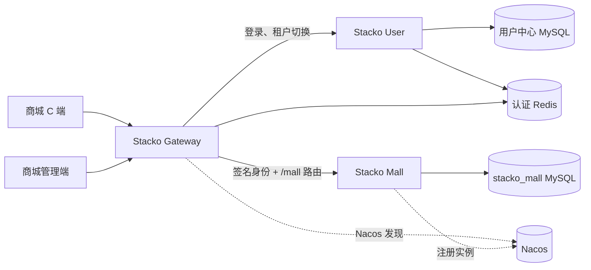
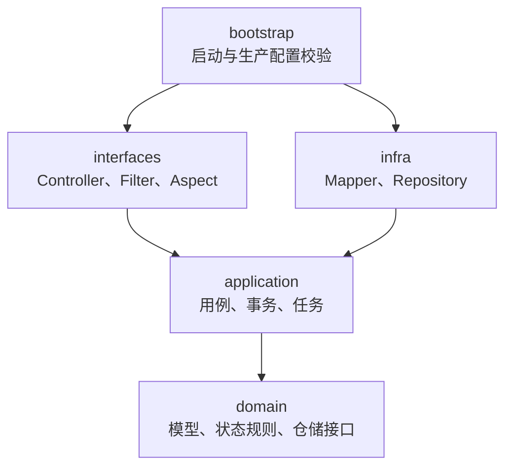
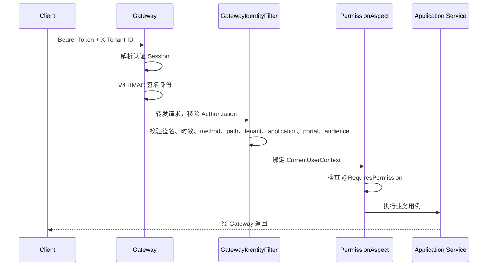
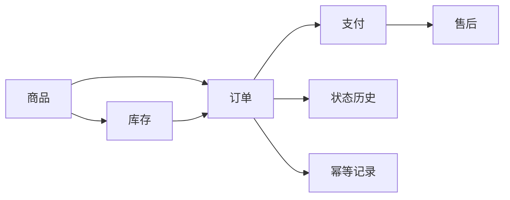

# 商城架构设计

## 1. 定位与边界

商城负责：

- 商品和库存
- 订单及订单状态历史
- 模拟支付、回调幂等
- 售后申请、审核和退款
- 商城业务成员展示投影

商城不负责账号密码、登录、租户成员、角色和权限分配，也不直接读取 Sa-Token Redis。

## 2. 系统拓扑

所有外部请求从 Gateway 进入。Gateway 验证 Bearer Token 后生成 `X-Stacko-Identity`
V4，商城只接受校验通过且属于当前商城门户的身份。

## 3. 分层结构

业务状态流转放在领域和应用层，Controller 不直接操作 Mapper。

## 4. 请求安全链

`GatewayIdentityFilter` 负责认证身份的真实性，`PermissionAspect` 负责方法所需权限。二者职责不同，缺一不可。

门户边界：

- `/api/admin/**` 只接受 `stacko-mall-admin` 门户和 audience。
- `/api/c/**` 的受保护接口只接受 `stacko-mall-web` 门户和 audience。
- 两类会话即使属于同一账号、同一租户，也不能跨端调用。

受保护前缀默认为：

- `/api/admin/**`
- `/api/c/orders/**`
- `/api/c/after-sales/**`
- `/api/c/addresses/**`
- `/api/c/members/**`

这些路径缺少合法签名身份时默认拒绝。管理端 Controller 的所有 public 方法必须声明 `@RequiresPermission`，`AdminPermissionCoverageTest` 用于防止新增接口漏标。

Gateway 不再维护 URL 到业务权限码的映射。新增功能只需在商城方法声明权限，并把权限码加入用户中心权限目录。

用户中心通过全局 `up_application_permissions` 明确 `mall:*` 权限归属商城，并通过
`up_portal_permission_scopes` 维护平台级门户策略。商城管理端 Token 只会收到
`stacko-mall-admin` 范围内的商城权限，用户端 Token 只会收到 `stacko-mall-web` 范围内的权限；
即使同一成员角色同时拥有两端权限，也不能通过另一端 Token 携带或使用它们。

用户中心中的角色、权限目录或门户策略变化后，相关 access token 会失效，但 refresh token
继续有效。商城管理端和用户端收到首次 `401` 时，会合并并发刷新请求，通过用户中心重新
加载数据库中的最新角色、权限和门户范围，更新 Token 后重放原业务请求。只有门户准入被
撤销、成员被停用等无法继续访问的情况才回到登录页。

## 5. 多租户规则

- Gateway 身份中包含 `tenantId`、`accountId`、`membershipId`、`applicationCode`、
  `portalCode` 和 `audience`。
- 请求的 `X-Tenant-ID` 必须与签名身份租户一致。
- 商城主表必须包含 `tenant_id`，仓储查询必须带租户条件。
- `buyer_id` 等主体引用不能替代 `tenant_id`。
- 用户名等展示字段可做本地快照，但不参与鉴权。

## 6. 业务模块

### 商品与库存

商品和库存分表维护。创建商品不会自动代表库存充足，需要显式设置或调整库存。下单时校验并扣减库存，关闭订单或退款流程按业务规则释放库存。

### 订单

订单保存商品名称和价格快照，避免商品后续修改影响历史订单。定时任务扫描超时 `CREATED` 订单并关闭。

### 支付与售后

当前支付是模拟实现，回调通过独立 HMAC 密钥校验并使用幂等记录防止重复处理。售后覆盖申请、审核和退款主流程。

## 7. 权限目录

当前管理端权限包括：

- `mall:product:create/update/read/list`
- `mall:category:create/update/delete/read/list`
- `mall:stock:set/adjust/read/list`
- `mall:order:list/read/ship/close`
- `mall:payment:read`
- `mall:afterSales:read/review/refund`

权限定义保存于用户中心数据库。新权限应由平台管理员在用户中心“应用管理”中维护，并
配置到对应门户策略。
门户准入另使用 `portal:stacko-mall-admin:access` 和
`portal:stacko-mall-web:access`，它们不替代上述功能权限。

## 8. 待完善事项

当前商城业务和生产化待完善项统一维护在 [roadmap.md](roadmap.md)。架构文档只描述当前
已经落地的边界、链路和业务规则。
